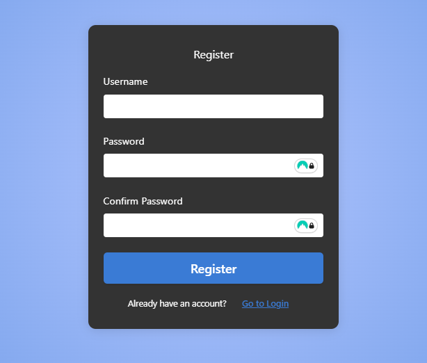
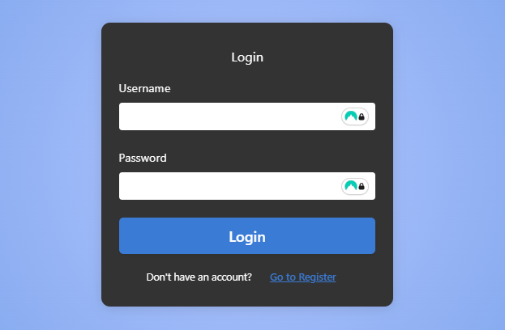
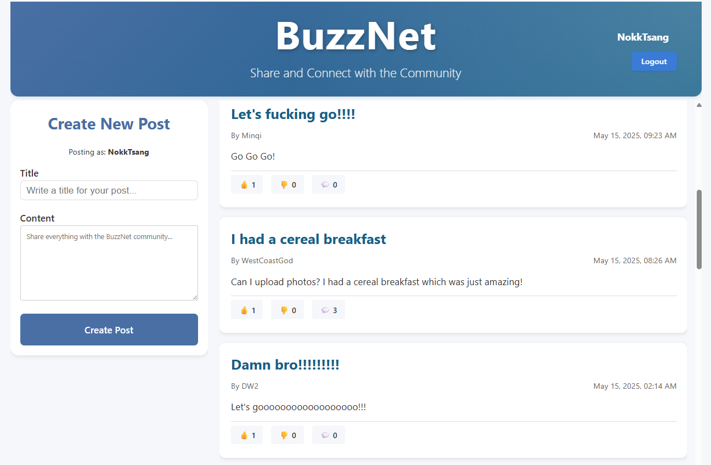
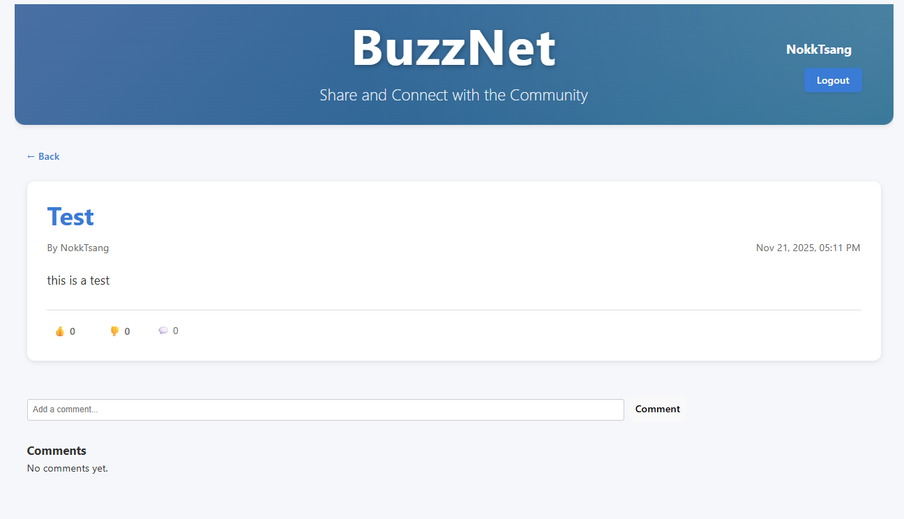

# BuzzNet

- Group Project for CSCI3100 Software Engineering 2024-25 Sem 2 at CUHK

## This is online deployed version of BuzzNet !
- Let's chat at https://buzz-net-tau.vercel.app/

# Usage Guide

### 1. Registration
Create your BuzzNet account to start connecting with others.

- Click on the "Register" button
- Fill in your username and password
- Submit the form to create your account

**Password Requirements:**
- Must be at least 8 characters long
- Must include at least 1 uppercase letter (A-Z)
- Must include at least 1 lowercase letter (a-z)
- Must include at least 1 number (0-9)

### 2. Login
Access your BuzzNet account with your credentials.

- Enter your registered username and password
- Click "Login" to access your feed

### 3. Main Feed
Once logged in, you'll see the main feed where all posts are displayed.

- Browse through posts from all users
- Create your own post
- Like and comment on other posts
- View the post page by clicking the post
- Only posts or comments created by you can be deleted

### 4. Post Page

- Check the comments under the post
- Comment your thoughts on the content

## Features

- **User Authentication**: Secure registration and login system
- **Post Creation**: Share updates and thoughts
- **Social Interaction**: Like and comment on posts
- **Real-time Updates**: Stay connected with the latest posts

# More about the development
- Check the upstream repository https://github.com/davidwkk/BuzzNet